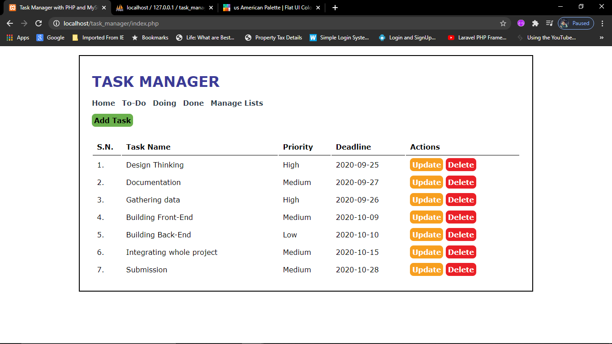
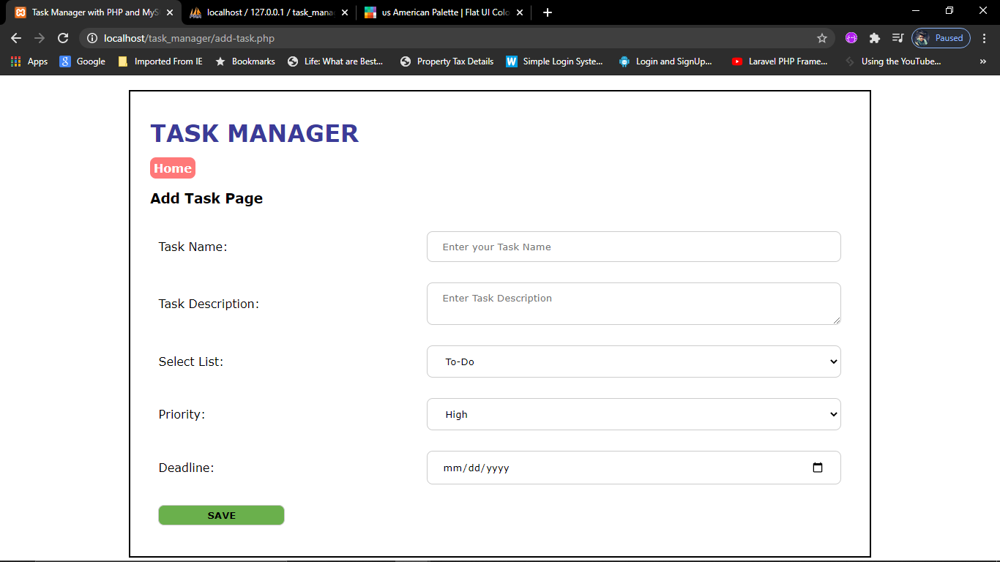
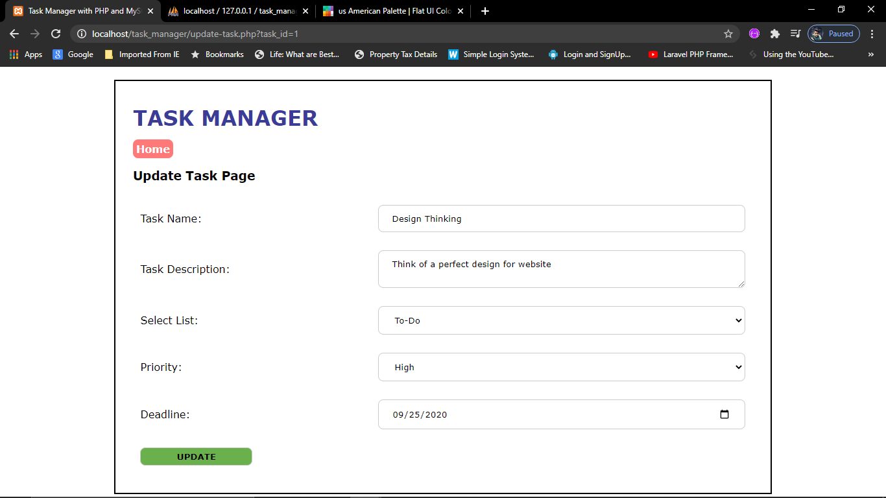
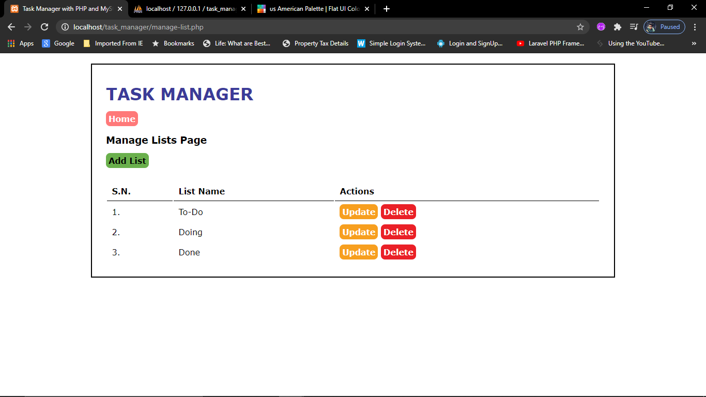
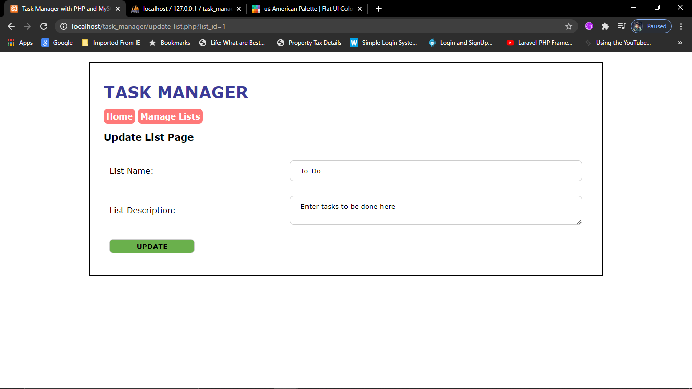
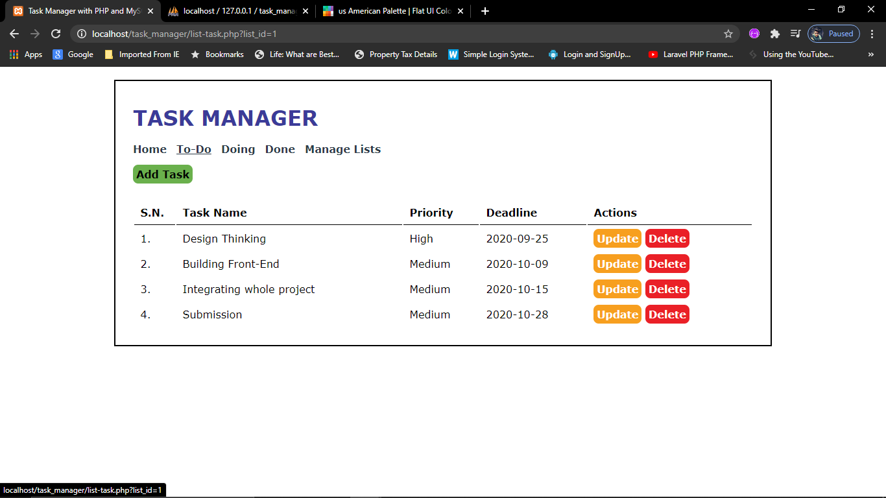
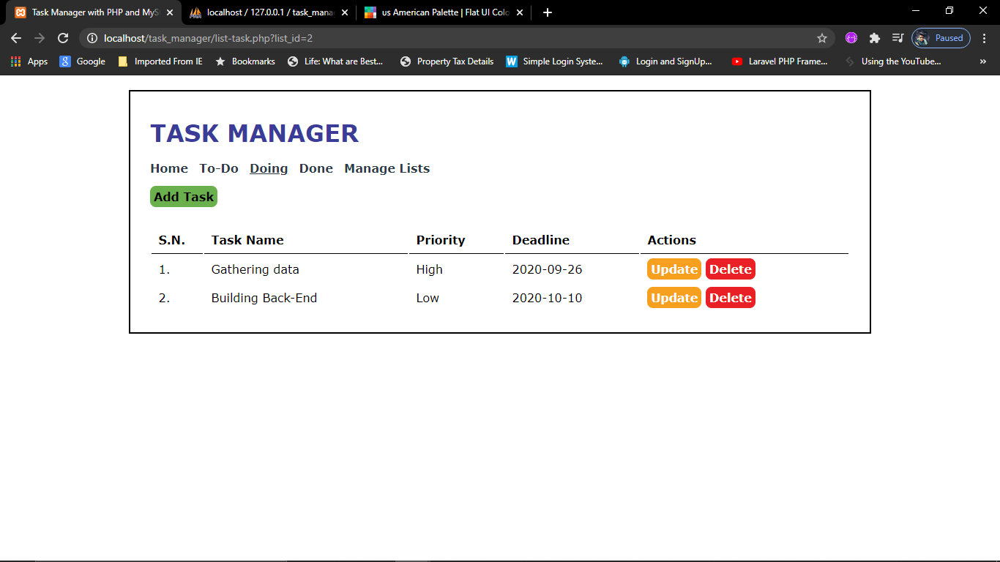
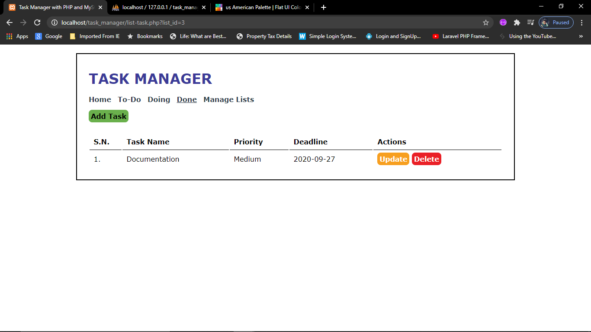

# Task_Manager
This is a simple PHP based Task Manager application which helps you to keep a track
of tasks on a daily basis. You can add/update/delete Tasks as well as you can categorize
the tasks by lists. Also you can add/update/delete lists.

## Following is an example of the working of the Manager:-

1] This is the home page which displays all the tasks. Also you can update/delete the
	task just by clicking on the button.

2] On this page you can add a new task.

3] On this page you can update an existing task.

4] This page displays all the lists. You can use lists to categorize the tasks.
	For Eg: If my task1 is done, I can create a list as "Done" and add that 
	task in this category.

5] On this page you can update the lista.

6] On this page you can add new lists.

7]This page is a list(category) and displays task under it.

  

